# STM32 中断与定时器


## 一、中断基础概念

### 1.1 什么是中断？

中断（Interrupt）是 CPU 在执行主程序的过程中，由**外部或内部事件**主动打断当前程序的执行，转去执行一段专门的处理程序（中断服务函数），处理完毕后再返回原程序继续执行的一种机制。

**为什么要用中断？** ：

想象这样一个场景:

你在写作业，你的同学将会来到你家打电动，你要下楼给他开门

我们可以用这种方法实现
```c
void main()
{
    while(1)
    {
        doHomeworkOnce(); // 做一次作业
        if(checkDoor() == FRIEND_COME) // 主动检查门是否被敲，如果是同学则开始打电动
        {
            playVideoGames();
        }
    }
}
```
这样就会产生几个问题:
- 如果 `doHomeworkOnce()` 的执行时间过长，你做一次作业的时间太长，你的朋友就会在门口等很久
- 每完成一次作业就需要下楼检查一次门，会耗费体力(CPU资源)
- 实际程序中，我们可能要响应大量的外部事件，使用轮询会严重影响我们程序的时效性

这显然不是正常人的逻辑

正常人的思路:
```
写作业 <--|
  |------|
  ↓
同学敲门
  |
  ↓
打电动
```
正常人是一直写作业，知道听到朋友敲门，才去开门
但是，对于单片机来说，一般情况下用户程序只有一个入口`__main` 或 `main` ，也就是说程序是线性的，无法自动对外界响应，只能主动轮询

因此我们引入中断这一概念，借助中断，我们可以实现对事件的实时响应


| 特性 | 轮询（Polling） | 中断（Interrupt） |
|------|----------------|-----------------|
| CPU 占用 | 持续查询，浪费资源 | 空闲时执行主程序，事件触发才响应 |
| 响应速度 | 取决于轮询频率，延迟较大 | 事件触发立即响应，速度快 |
| 适用场景 | 简单、实时性要求不高的场合 | 实时性要求高、多任务场景 |

### 1.2 中断的触发与执行流程
中断是一套由软件系统和硬件系统深度结合的响应系统

| 中文 | 解释 |
|--------|--------|
| 中断源 | 引起中断的事件 |
| 中断请求 | 中断源向处理器提出处理的请求 |
| 断点 | 发生中断时被打断程序的暂停点 |
| 中断响应 | 处理器暂停现行程序而转为响应中断请求的过程 |
| 中断服务例程 | 处理中断源的程序 |
| 中断向量表 | 存储中断服务例程地址的内存结构 |
| 中断返回 | 返回断点的过程 |
| 嵌套向量中断控制器 | 管理中断和异常, 仲裁中断的硬件模块 |
---
<br>
中断的处理流程如下：

```
外设产生中断请求
        ↓
NVIC 接收并判断优先级
        ↓
CPU 保存当前程序上下文
        ↓
跳转到中断向量表，获取 ISR 地址
        ↓
执行 ISR
        ↓
清除中断标志位
        ↓
恢复上下文，返回主程序
```

### 1.3 中断优先级与嵌套

如果有两个事件同时触发，我该优先处理哪个呢？

这时候就需要用到 **嵌套中断** 了

- **抢占优先级（Preemption Priority）**：决定高优先级中断能否打断正在执行的低优先级中断。数值越小优先级越高。
- **子优先级（Sub Priority）**：当两个中断的抢占优先级相同时，子优先级高的先执行。
- **自然优先级**：当抢占优先级和子优先级都相同时，按向量表顺序排队。

高优先级的中断会像中断打断常规任务一样打断低优先级中断，等待高优先级中断结束后才继续执行低优先级中断
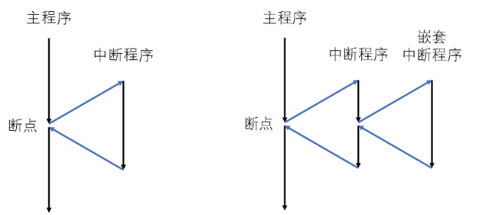

---

## 二、STM32 中断系统


### 2.1 外部中断 EXTI

EXTI（External Interrupt/Event Controller）是 STM32 用来处理**外部事件触发中断**的模块。

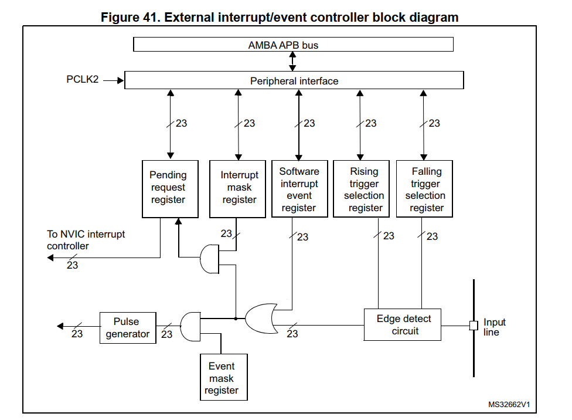

### 2.2 NVIC（嵌套向量中断控制器）

> 具体细节参考 `RM0090` : Section `12` 与 `PM0214` : Section `4.3`

NVIC 是 ARM Cortex-M 内核的一部分，与 CPU 紧密耦合，是 STM32 中断管理的核心。它提供以下特性：

- **可嵌套中断**：高优先级可打断低优先级 ISR
- **向量中断**：硬件自动定位中断入口，无需软件判断
- **动态优先级调整**：可在程序运行中修改优先级
- **极低的中断延迟**：末尾连锁（Tail-Chaining）和迟到（Late Arrival）机制大幅缩短切换时间
- **中断可屏蔽**：可灵活控制每个中断通道的使能与禁用

> 注: 虽然在PM 中，NVIC被写在 `Core Peripheral` 中，但从硬件上看，NVIC是内核的一部分，并不是常见语境的外设，它有一个特殊的翻译 `内核外设`


### 2.3 中断向量表 (Interrupt Vector Table)

中断向量表是一段预先定义好的地址列表，每个地址对应一个中断源的 ISR 入口函数。默认存放于 Flash 起始地址 `0x08000000`。

通过中断向量表，经过NVIC处理后的中断信号可以在IVT中找到对应的函数地址

STM32的中断向量表在代码中储存在启动文件 `startup_*.s`，采用汇编语言

### 2.4 简化的中断模型

正如前文所说，中断的实现是软件于硬件的深度结合，在此，我们将软硬件的过程结合，帮助大家理解
> **注意** 虽然我们在概念上把软件和硬件分开，但我们必须深刻意识到软件是运行在硬件上的，软件的实现实际上是基于硬件的动作

> **注意** 我们在此讨论的是硬件中断，软件中断通路与此有些不同

```
硬件外设
   |
   |    产生中断信号
   V
  EXTI  捕获到外设产生的中断信号，并检测该中断是否启用(掩码)，并置标志位
   |
   |    如果该中断启用
   v
  NVIC  对中断进行仲裁等处理，选择出应该执行的中断号(不是前面的中断信号)
   |
   |    将中断号传给内核
   v
  内核  1.接收到中断号后，保护现场，在IVT中找到中断号所对应ISR并进入中断处理函数
        2.中断函数运行完成后(记得清除中断标志位)，恢复现场，继续执行之前程序

```
>**注意** 根据PM手册，如果不清除标志位，NVIC将不会再对EXTI的该中断响应

### 2.5 中断程序实例

#### 2.5.1 CubeMX配置
现在我们借助中断来实现KEY点灯

GPIO既可以输出也可以输入，在此我们把它配置到EXTI上


>GPIO的配置详见 `RM0090` Section `8.3`

根据原理图，我们的开发板提供了一个上拉电阻，同时还提供了一个滤波电容，因此我们不需要做软件消抖

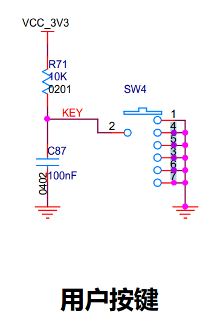

CubeMX配置

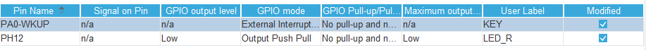

记得在NVIC中启用中断

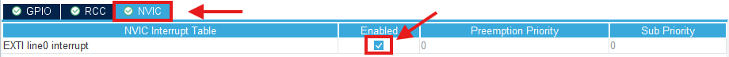

#### 2.5.1 代码编写

开启中断后，HAL库为我们提供了默认的中断回调函数，一般是弱定义的空函数，保证了如果用户没有定义回调函数，程序也不会出错

```c
/**
  * @brief  EXTI line detection callbacks.
  * @param  GPIO_Pin Specifies the pins connected EXTI line
  * @retval None
  */
__weak void HAL_GPIO_EXTI_Callback(uint16_t GPIO_Pin)
{
  /* Prevent unused argument(s) compilation warning */
  UNUSED(GPIO_Pin);
  /* NOTE: This function Should not be modified, when the callback is needed,
           the HAL_GPIO_EXTI_Callback could be implemented in the user file
   */
}
```
>tips: `__week` 是gcc的C扩展，不属于ISO标准，准许我们在程序里重定义这个弱函数

>FAQ: 这里只传了 `GPIO_Pin`, 我们如何知道是哪个 `GPIO_Port` 呢？(见 `RM0090` Section `12.2.5` `9.2.3`)

但是我们显然不想执行默认的函数，因此我们可以重写这个函数


所有开启了的中断ISR都会写在 `stm32f4xx_it.h` 中，我们可以借助这个入口寻找到需要重定义的函数

为了让我们的这个项目的结构更加清晰，我们一般不会在项目的库函数里做改动，因此我们在项目根目录下新建一个我们自己的文件夹`User`
- 新建 `User`
- 新建 `drv_key.c` `drv_key.h`

drv_key.h
```c
#pragma once
#include "main.h"
```
drv_key.c
```c
#include "drv_key.h"

void HAL_GPIO_EXTI_Callback(uint16_t GPIO_Pin)
{
    switch(GPIO_Pin)
    {
        case LED_R_Pin:
        {
            HAL_GPIO_TogglePin(LED_R_GPIO_Port, LED_R_Pin);
        }break;
        default: break;
    }
}
```
现在我们就可以通过按键控制灯的亮灭了

获得成就: 点灯大蛇

---

## 三、定时器概述

### 3.1 为什么需要定时器？

定时器（Timer）是 STM32 中最常用的外设之一，能够精确控制时间：定时触发中断、PWM 输出、测量外部信号、生成精确延时等。相比软件延时（循环空转），定时器不占用 CPU 资源，精度高且可与 CPU 并行工作。

### 3.2 STM32 定时器分类
STM32的不同定时器的性能不同，能实现的功能也不同
在STM32F4xx中，定时器分为
|定时器|类别|
|---|---|
|TIM1&TIM8|Advanced-control timers|
|TIM2-TIM5|General-purpose timers|
|TIM9-TIM14|General-purpose timers|
|TIM6&TIM7|Basic timers|
其中TIM2&TIM5是32bit的定时器

### 3.3 定时器常用时钟源

通用定时器的时钟来源有四种：

1. **内部时钟（CK_INT）**：最常用，直接使用 APB 时钟倍频后的频率
2. **外部时钟模式 1**：通过 TIx（CH1/CH2/CH3/CH4）引脚输入
3. **外部时钟模式 2**：通过 ETR 引脚输入
4. **内部触发输入（ITRx）**：由其他定时器触发

---

## 四、定时器核心功能

### 4.1 计数器模式

定时器的核心是一个 16 位自动重装载计数器（TIMx_CNT），支持三种计数模式：

#### 向上计数（Up Count）
- 计数器从 0 开始，每来一个时钟脉冲 +1
- 计数至 ARR（自动重装载值）时触发上溢事件，计数器归 0 重新开始

#### 向下计数（Down Count）
- 计数器从 ARR 值开始，每来一个时钟脉冲 -1
- 计数至 0 时触发下溢事件，计数器回到 ARR 重新开始

#### 中央对齐模式（Center-Aligned）
- 计数器从 0 向上计数至 ARR-1，触发上溢；然后从 ARR 向下计数至 1，触发下溢
- 交替执行，常用于电机控制（SVPWM）等需要中间对齐波形的场景

### 4.2 预分频器（Prescaler）与自动重装载

在默认状态下，定时器的时钟源是内部总线时钟，为了达到我们想要的时间，所以我们要进行分频处理。具体细节见 `RM0090` Section `7.2` `17.2`

分频完成后，定时器会捕获分频器输出的脉冲，然后根据计数器模式进行计数，当计数器达到重装载值(ARR, Auto Reload Register)后可以根据用户的设置进行重置，用户可以选择是否在重装载值到达时触发中断


### 4.3 捕获/比较通道

每个通用定时器有 **4 个独立通道**（CH1~CH4），每个通道可独立配置为：

#### 输入捕获（Input Capture）
- 检测引脚上的边沿跳变（上升沿/下降沿）
- 将当前计数器 CNT 的值锁存到 CCRx 寄存器
- 用于测量脉冲宽度和频率

#### 输出比较（Output Compare）
- 将计数器 CNT 与 CCRx 比较
- 匹配时翻转输出引脚电平或触发中断
- 用于生成精确 timing 信号

#### PWM 生成（PWM Mode）***重点**

PWM是控制高低电平输出时间的信号，可以借助PWM控制LED的亮度，电机的速度等

- 是输出比较模式的特例，输出固定频率的脉宽调制信号
- 可配置 PWM1 和 PWM2 两种模式


PWM信号的产生本质上也是定时器的比较
|条件|PWM1|PWM2|
|---|---|---|
|CNT<CCRx|1|0|
|CNT>=CCRx|0|1|

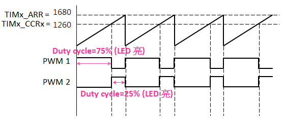

由于STM32F407的一个定时器有多个定时器通道，也就是有多个CCR，因此通过更改不同通道的CCR值可以实现一个定时器输出不同的PWM信号，节省定时器资源

### 4.4 编码器接口

MG370电机采用的是A/B相正交编码器

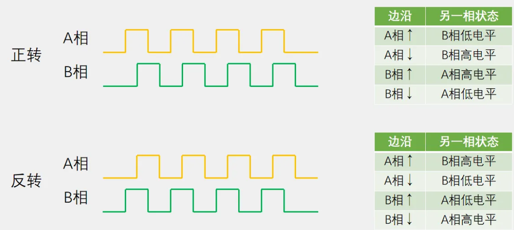

在STM32中，部分定时器可以直接硬件解码这种信号，这就是编码器接口(Encoder Interface)

在此我们不讨论具体硬件原理，只需要学会使用即可

---

## 五、中断与定时器的结合应用

在这个项目中，我们将实现
- 用PWM驱动电机
- 用Encoder Interface实现读取电机转速
- 通过UART通信将转速输出到电脑上，并实现UART控制PWM
> UART通信我们还没有讲解，在此只是应用，我们将在后面的课程中学习，有兴趣的同学可以观看 [中科大RM电控教学](https://www.bilibili.com/video/BV1db4y1a7Xe/?share_source=copy_web&vd_source=de770ffc23fc2651b6ae5b4b0694e6a0)

### 5.1 配置CubeMX

#### 5.1.1 配置PWM输出
- 找到TIM8
- 将CH1配置为PWM输出
- 将CH1引脚修改到PC6
- 根据手册判断主频
- 按照PWM输出频率为1KHz计算并配置分频，在此我们把ARR设置为5000-1，这意味着我们的PWM的分辨率为5000

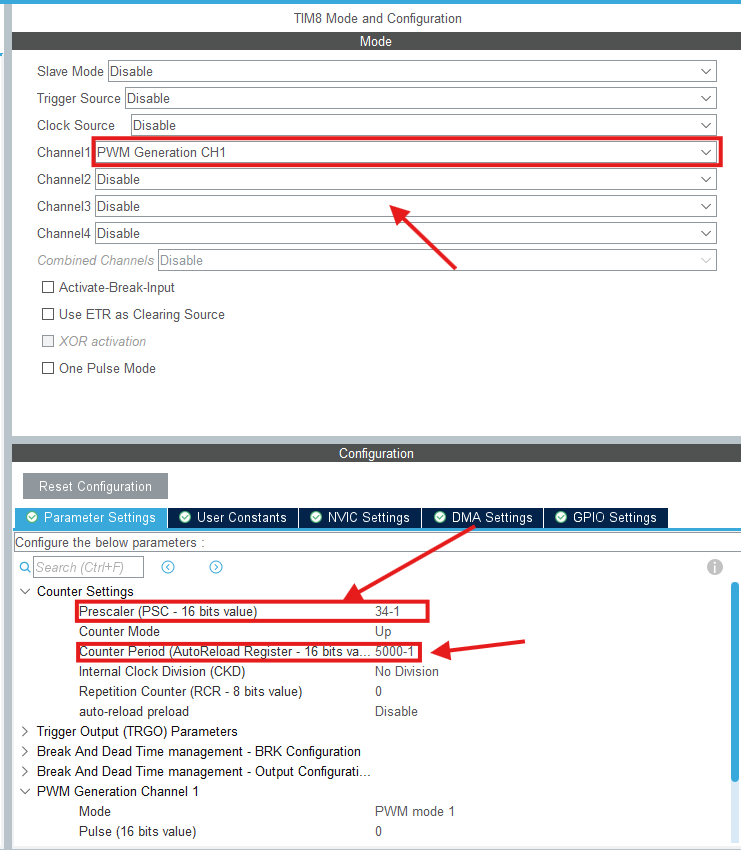
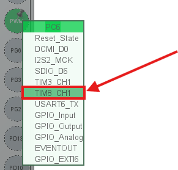

#### 5.1.2 配置Encoder Interface
- 找到TIM1
- Combined Channels 选择 `Encoder Mode`
- Encoder Mode 选择 `Encoder Mode T1 and T2`
- 同理将CH1, CH2分别配置为 `PE9` `PE11`


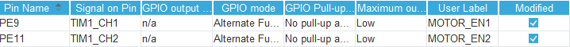

#### 5.1.3 配置UART
- 找到USART1
- 选择异步模式
- 配置引脚
- 打开中断


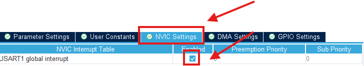

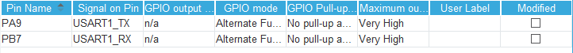

### 5.2 编写程序
#### 5.2.1 编写PWM驱动
- 在 `User` 下新建 `bsp_pwm.c` `bsp_pwm.h`

根据之前的原理，想要更改PWM占空比就是要更改当前通道的CCR值

在 `stm32f4xx_hal_tim.h` 中，HAL库为我们提供了宏去直接修改CCR值

```c
/**
  * @brief  Set the TIM Capture Compare Register value on runtime without calling another time ConfigChannel function.
  * @param  __HANDLE__ TIM handle.
  * @param  __CHANNEL__ TIM Channels to be configured.
  *          This parameter can be one of the following values:
  *            @arg TIM_CHANNEL_1: TIM Channel 1 selected
  *            @arg TIM_CHANNEL_2: TIM Channel 2 selected
  *            @arg TIM_CHANNEL_3: TIM Channel 3 selected
  *            @arg TIM_CHANNEL_4: TIM Channel 4 selected
  * @param  __COMPARE__ specifies the Capture Compare register new value.
  * @retval None
  */
#define __HAL_TIM_SET_COMPARE(__HANDLE__, __CHANNEL__, __COMPARE__) \
  (((__CHANNEL__) == TIM_CHANNEL_1) ? ((__HANDLE__)->Instance->CCR1 = (__COMPARE__)) :\
   ((__CHANNEL__) == TIM_CHANNEL_2) ? ((__HANDLE__)->Instance->CCR2 = (__COMPARE__)) :\
   ((__CHANNEL__) == TIM_CHANNEL_3) ? ((__HANDLE__)->Instance->CCR3 = (__COMPARE__)) :\
   ((__HANDLE__)->Instance->CCR4 = (__COMPARE__)))
```
因此，我们只需要在 `bsp_pwm.c` 中封装一下就行

bsp_pwm.h
```c
#pragma once
#include "main.h"
void setPwmDuty(uint32_t duty);
```

bsp_pwm.h
```c
#include "bsp_pwm.h"
#include "tim.h"


/**
 *  @brief Set PWM duty
 * 
 *  @param duty must between 0-4999
 */
void setPwmDuty(uint32_t duty)
{
    if(duty >4999)
        return;
    __HAL_TIM_SET_COMPARE(&htim8, TIM_CHANNEL_1, duty);
}
```

#### 5.2.2 编写Encoder驱动

encoder的原理很简单，硬件会在正转时对CNT++，反转时对CNT--，我们只需要CNT/TIME即可

bsp_encoder.h
```c
#pragma once

#include "main.h"

/* Motor-side encoder: 11 pulses per motor revolution. */
#define ENCODER_PULSE_PER_MOTOR_REV 11u
#define ENCODER_QUADRATURE_MULTIPLE 4u
#define ENCODER_GEAR_RATIO          21.3f
#define ENCODER_DIRECTION           1

void Encoder_Init(void);
float Encoder_GetRPM(void);

```

bsp_encoder.c
```c
#include "bsp_encoder.h"
#include "tim.h"

static int16_t encoder_last_count = 0;
static uint32_t encoder_last_tick = 0;

#define ENCODER_COUNTS_PER_MOTOR_REV  (ENCODER_PULSE_PER_MOTOR_REV * ENCODER_QUADRATURE_MULTIPLE)

void Encoder_Init(void);
void Encoder_Reset(void);
int32_t Encoder_GetCount(void);
void Encoder_Reset(void);
float Encoder_GetMotorRPM(void);
float Encoder_GetRPM(void);


void Encoder_Init(void)
{
    HAL_TIM_Encoder_Start(&htim1, TIM_CHANNEL_ALL);
    Encoder_Reset();
}

int32_t Encoder_GetCount(void)
{
    return (int32_t)__HAL_TIM_GET_COUNTER(&htim1);
}

void Encoder_Reset(void)
{
    __HAL_TIM_SET_COUNTER(&htim1, 0);
    encoder_last_count = 0;
    encoder_last_tick = HAL_GetTick();
}

float Encoder_GetMotorRPM(void)
{
    uint32_t now_tick = HAL_GetTick();
    uint32_t dt_ms = now_tick - encoder_last_tick;

    if(dt_ms == 0)
    {
        return 0.0f;
    }

    int16_t now_count = (int16_t)__HAL_TIM_GET_COUNTER(&htim1);
    int16_t delta_count = (int16_t)(now_count - encoder_last_count);

    encoder_last_count = now_count;
    encoder_last_tick = now_tick;

    return ((float)delta_count * (float)ENCODER_DIRECTION * 60000.0f) /
           ((float)ENCODER_COUNTS_PER_MOTOR_REV * (float)dt_ms);
}

float Encoder_GetRPM(void)
{
    return Encoder_GetMotorRPM() / ENCODER_GEAR_RATIO;
}

```

