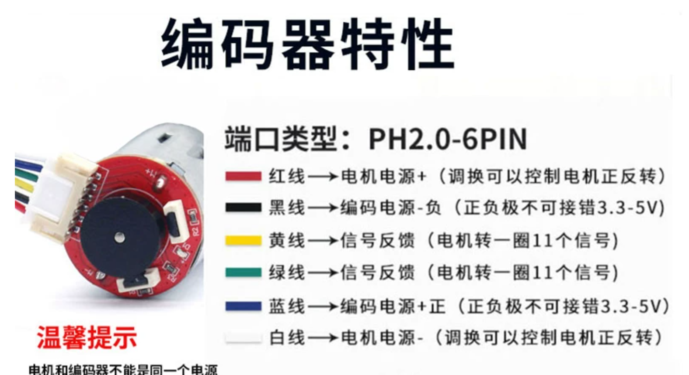
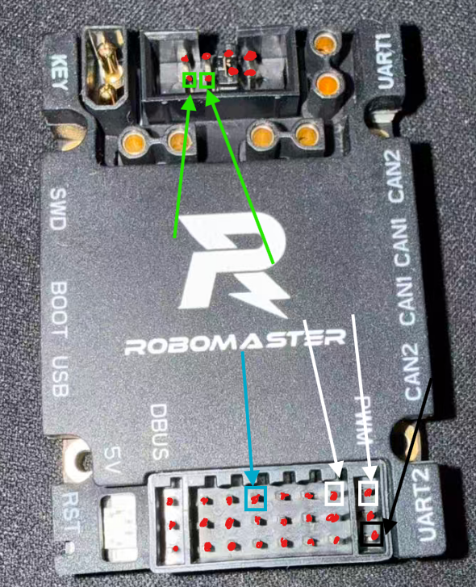

# TB6612 及 AB 相编码器的使用方法

## 本节内容

- 理解 TB6612 电机驱动芯片的控制逻辑
- 使用 STM32 的 PWM 输出控制直流电机速度
- 使用 GPIO 控制电机正转、反转、停止和刹车
- 使用 STM32 定时器 Encoder Interface 读取 AB 相编码器
- 根据编码器计数计算电机转速
- 结合本项目代码完成一个“给定转速并实时回传实际转速”的小系统

本教程对应当前项目：

```text
Projects/Project
```

项目中的主要配置如下：

| 功能 | STM32 外设/引脚 | 项目宏定义 | 说明 |
|---|---|---|---|
| TB6612 PWM | TIM8_CH1 / PC6 | MOTOR_PWM | 控制电机速度 |
| TB6612 IN1 | PF0 | MOTOR_OUT1 | 控制电机方向 |
| TB6612 IN2 | PF1 | MOTOR_OUT2 | 控制电机方向 |
| 编码器 A 相 | TIM1_CH1 / PE9 | MOTOR_EN1 | 编码器计数输入 |
| 编码器 B 相 | TIM1_CH2 / PE11 | MOTOR_EN2 | 编码器计数输入 |
| 采样定时器 | TIM6 | htim6 | 100Hz 周期读取速度 |
| 串口输出 | USART1 | huart1 | 向电脑发送 rpm |

---

## 一、整体工作流程

这个项目做的事情可以拆成两条线：

```text
控制线：

目标转速
   |
   v
TB6612_SetRPM()
   |
   |-- 根据正负号设置 PF0/PF1
   |
   |-- 根据转速大小设置 TIM8_CH1 PWM 占空比
   |
   v
TB6612 驱动电机转动
```

```text
测量线：

电机转动
   |
   v
AB 相编码器输出 A/B 两路脉冲
   |
   v
TIM1 Encoder Interface 硬件计数
   |
   v
每隔 10ms 读取一次 CNT 差值
   |
   v
计算 rpm
   |
   v
USART1 发送到电脑
```

所以，TB6612 负责“让电机怎么转”，编码器负责“告诉我们电机实际转得怎么样”。

---

## 二、TB6612 电机驱动

### 2.1 为什么不能直接用 STM32 驱动电机

STM32 的 GPIO 只能输出很小的电流，适合控制信号，不适合直接带电机。直流电机启动时电流很大，而且电机是感性负载，会产生反电动势。如果直接接到 STM32 引脚上，轻则电机转不动，重则烧芯片。

TB6612 是一个双路直流电机驱动芯片。STM32 只需要给它几个控制信号，真正给电机供电的大电流由 TB6612 承担。

### 2.2 TB6612 常用引脚

以单路电机 A 为例，常用引脚如下：

| TB6612 引脚 | 作用 | 在本项目中的连接 |
|---|---|---|
| PWMA | PWM 输入，控制速度 | PC6 / TIM8_CH1 |
| AIN1 | 方向控制输入 1 | PF0 / MOTOR_OUT1 |
| AIN2 | 方向控制输入 2 | PF1 / MOTOR_OUT2 |
| AO1/AO2 | 电机输出 | 接电机两端 |
| VM | 电机供电 | 接电机电源 |
| VCC | 逻辑供电 | 一般接 3.3V 或 5V，按模块要求 |
| GND | 地 | 必须与 STM32 共地 |
| STBY | 待机控制 | 需要拉高，否则驱动不工作 |

> 注意：很多 TB6612 模块会把 STBY 引脚引出来。如果电机完全不动，第一件事就是确认 STBY 是否已经拉高。

### 2.3 TB6612 方向真值表

TB6612 的方向由 IN1 和 IN2 决定，速度由 PWM 决定。

| IN1 | IN2 | PWM | 电机状态 |
|---|---|---|---|
| 0 | 0 | 任意 | 停止，滑行 |
| 1 | 0 | PWM | 正转 |
| 0 | 1 | PWM | 反转 |
| 1 | 1 | 任意 | 短刹车 |

当前项目中的代码正是按这个表写的：

```c
void TB6612_SetDirection(TB6612_Dir_t dir)
{
    switch(dir)
    {
        case TB6612_DIR_FORWARD:
            HAL_GPIO_WritePin(MOTOR_OUT1_GPIO_Port, MOTOR_OUT1_Pin, GPIO_PIN_SET);
            HAL_GPIO_WritePin(MOTOR_OUT2_GPIO_Port, MOTOR_OUT2_Pin, GPIO_PIN_RESET);
            break;

        case TB6612_DIR_REVERSE:
            HAL_GPIO_WritePin(MOTOR_OUT1_GPIO_Port, MOTOR_OUT1_Pin, GPIO_PIN_RESET);
            HAL_GPIO_WritePin(MOTOR_OUT2_GPIO_Port, MOTOR_OUT2_Pin, GPIO_PIN_SET);
            break;

        case TB6612_DIR_BRAKE:
            HAL_GPIO_WritePin(MOTOR_OUT1_GPIO_Port, MOTOR_OUT1_Pin, GPIO_PIN_SET);
            HAL_GPIO_WritePin(MOTOR_OUT2_GPIO_Port, MOTOR_OUT2_Pin, GPIO_PIN_SET);
            break;

        case TB6612_DIR_STOP:
        default:
            HAL_GPIO_WritePin(MOTOR_OUT1_GPIO_Port, MOTOR_OUT1_Pin, GPIO_PIN_RESET);
            HAL_GPIO_WritePin(MOTOR_OUT2_GPIO_Port, MOTOR_OUT2_Pin, GPIO_PIN_RESET);
            break;
    }
}
```

如果发现你认为的“正转”和实际方向相反，有两种改法：

- 交换电机 AO1/AO2 两根线
- 修改 `TB6612_RPM_DIR` 为 `-1.0f`，在这里，你可以通过软件定义正反转方向

---

## 三、PWM 控速原理

### 3.1 PWM 是什么

PWM 的中文名叫脉冲宽度调制。它不是直接输出一个模拟电压，而是在高低电平之间快速切换。

比如电源是 12V：

| 占空比 | 近似效果 |
|---|---|
| 0% | 电机不转 |
| 20% | 等效电压较低，电机慢 |
| 50% | 中等速度 |
| 100% | 全速 |

这里的“等效电压”只是帮助理解。真实电机速度还会受到负载、摩擦、电池电压、电机特性影响，所以占空比和转速不是严格线性关系。

### 3.2 本项目 TIM8 的 PWM 配置

项目中 `TIM8` 的配置在 `Core/Src/tim.c`：

```c
htim8.Instance = TIM8;
htim8.Init.Prescaler = 34 - 1;
htim8.Init.Period = 5000 - 1;
```

系统中 APB2 定时器时钟为 168MHz，因此：

```text
PWM 频率 = 168MHz / 34 / 5000
         = 988.2Hz
         约等于 1kHz
```
之所以选择1kHz，是因为TB6612的推荐输入 PWM 频率是 1kHz。这个可以从淘宝商详页等地方获取。

`Period = 5000 - 1`，说明计数范围是 `0 ~ 4999`，所以 PWM 占空比也用 `0 ~ 4999` 表示。

| CCR 值 | 占空比 |
|---|---|
| 0 | 0% |
| 2500 | 约 50% |
| 4999 | 约 100% |

### 3.3 修改占空比

HAL 库提供了宏：

```c
__HAL_TIM_SET_COMPARE(&htim8, TIM_CHANNEL_1, duty);
```

项目中封装在 `User/bsp_pwm.c`：

```c
void setPwmDuty(uint32_t duty)
{
    if(duty > 4999)
        return;

    __HAL_TIM_SET_COMPARE(&htim8, TIM_CHANNEL_1, duty);
}
```

这一步只改变 PWM 占空比，不改变方向。方向由 PF0/PF1 单独控制。

---

## 四、CubeMX 配置 TB6612

### 4.1 配置 PWM 引脚

在 CubeMX 中：

1. 找到 `TIM8`
2. 将 `Channel1` 配置为 `PWM Generation CH1`
3. 将引脚分配到 `PC6`
4. 设置 Prescaler 为 `34 - 1`
5. 设置 Counter Period 为 `5000 - 1`

对应当前工程：

```text
PC6 -> TIM8_CH1 -> MOTOR_PWM
```

### 4.2 配置方向 GPIO

将两个普通 GPIO 配置为输出：

```text
PF0 -> GPIO_Output -> MOTOR_OUT1
PF1 -> GPIO_Output -> MOTOR_OUT2
```

这两个引脚不需要复用功能，它们只负责输出高低电平。

### 4.3 代码中启动 PWM

CubeMX 只会初始化 TIM8，但不会自动开始 PWM 输出。必须在用户代码中调用：

```c
HAL_TIM_PWM_Start(&htim8, TIM_CHANNEL_1);
```

当前项目将它放在 `TB6612_Init()` 中：

```c
void TB6612_Init(void)
{
    HAL_TIM_PWM_Start(&htim8, TIM_CHANNEL_1);
    TB6612_Stop();
}
```

这样上电初始化后，PWM 通道被启动，同时电机默认停止，比较安全。

---

## 五、TB6612 驱动代码解析

### 5.1 头文件

当前项目文件：

```text
Projects/Project/User/drv_tb6612.h
```

核心内容：

```c
#define TB6612_PWM_MAX_DUTY 4999u
#define TB6612_MAX_RPM      282.0f
#define TB6612_RPM_DIR      1.0f

typedef enum
{
    TB6612_DIR_STOP = 0,
    TB6612_DIR_FORWARD,
    TB6612_DIR_REVERSE,
    TB6612_DIR_BRAKE
} TB6612_Dir_t;

void TB6612_SetRPM(float rpm);
void TB6612_Init(void);
```

几个宏的含义：

| 宏 | 含义 |
|---|---|
| `TB6612_PWM_MAX_DUTY` | PWM 最大 CCR 值，本项目是 4999 |
| `TB6612_MAX_RPM` | 近似最大输出轴转速，用来把 rpm 映射为 duty |
| `TB6612_RPM_DIR` | 方向修正，方向反了就改成 -1 |

### 5.2 设置目标转速

当前项目用 `TB6612_SetRPM(float rpm)` 作为上层接口：

```c
void TB6612_SetRPM(float rpm)
{
    float motor_rpm = rpm * TB6612_RPM_DIR;
    float abs_rpm = TB6612_AbsFloat(motor_rpm);
    uint32_t duty = 0;

    tb6612_target_rpm = rpm;

    if(abs_rpm <= 0.0f)
    {
        TB6612_Stop();
        return;
    }

    if(abs_rpm > TB6612_MAX_RPM)
    {
        abs_rpm = TB6612_MAX_RPM;
    }

    duty = (uint32_t)((abs_rpm / TB6612_MAX_RPM) * (float)TB6612_PWM_MAX_DUTY);

    if(motor_rpm > 0.0f)
    {
        TB6612_SetDirection(TB6612_DIR_FORWARD);
    }
    else
    {
        TB6612_SetDirection(TB6612_DIR_REVERSE);
    }

    TB6612_SetDuty(duty);
}
```

它做了三件事：

1. 根据 rpm 正负判断方向
2. 根据 rpm 绝对值计算 PWM 占空比
3. 限制最大转速，避免 duty 超出范围

例如：

```c
TB6612_SetRPM(100.0f);   // 正转，目标 100rpm
TB6612_SetRPM(-100.0f);  // 反转，目标 100rpm
TB6612_SetRPM(0.0f);     // 停止
```

> 注意：当前 `TB6612_SetRPM()` 是开环控制。它只是把目标 rpm 根据占空比*最高转速，粗略映射成 PWM，并不会自动保证实际速度等于目标速度。如果后续想做精准控速，需要加入 PID。

---

## 六、AB 相编码器原理

### 6.1 什么是 AB 相编码器

AB 相编码器会输出两路方波信号，通常叫 A 相和 B 相。它们不是同时变化的，而是相差四分之一个周期，也就是常说的 **90 度相位差**。

这种 A/B 两路相差 90 度的信号，就叫 **正交信号**。利用正交信号进行位置和方向判断，就叫 **正交编码**。


为什么要用两路信号？因为只有一路脉冲时，我们只能知道“动了多少”，不知道“往哪个方向动”。

例如只有 A 相：

```text
A: __--__--__--
```

看到 A 相跳变，只能说明编码器转过了一小格。但这小格可能是正转产生的，也可能是反转产生的。

加上 B 相后，情况就不一样了。A 相变化时，我们去看 B 相当前是高电平还是低电平；B 相变化时，我们也去看 A 相当前是高电平还是低电平。这样就能判断方向。

### 6.2 正交信号的四个状态

A 相和 B 相各自只有 0/1 两种电平，所以组合起来一共有 4 个状态：

| A 相 | B 相 | 二进制状态 |
|---|---|---|
| 0 | 0 | 00 |
| 1 | 0 | 10 |
| 1 | 1 | 11 |
| 0 | 1 | 01 |

编码器正常转动时，状态不会乱跳，而是按照固定顺序变化。

假设正转时状态顺序为：

```text
00 -> 10 -> 11 -> 01 -> 00 -> ...
```

那么反转时就会反过来：

```text
00 -> 01 -> 11 -> 10 -> 00 -> ...
```

这就是正交编码判断方向的核心：**不是看某一相有没有跳变，而是看 A/B 两相的状态变化顺序**。

如果你把这四个状态想成一个环，就更直观：

```text
        00
      /    \
    01      10
      \    /
        11
```

沿着一个方向绕就是正转，反方向绕就是反转。STM32 的 Encoder Interface 做的事情，本质上就是在硬件里观察这个状态环，然后决定 `CNT++` 还是 `CNT--`。

### 6.3 用“边沿 + 另一相电平”判断方向

图片右边的表格给出了另一种更贴近硬件的理解方式：当某一相出现边沿时，观察另一相的电平。

以上图中的定义为例，正转时：

| 当前边沿 | 另一相状态 | 判断 |
|---|---|---|
| A 相上升沿 | B 相低电平 | 正转 |
| A 相下降沿 | B 相高电平 | 正转 |
| B 相上升沿 | A 相高电平 | 正转 |
| B 相下降沿 | A 相低电平 | 正转 |

反转时则正好相反：

| 当前边沿 | 另一相状态 | 判断 |
|---|---|---|
| A 相上升沿 | B 相高电平 | 反转 |
| A 相下降沿 | B 相低电平 | 反转 |
| B 相上升沿 | A 相低电平 | 反转 |
| B 相下降沿 | A 相高电平 | 反转 |

这张表说明了一件很重要的事：**方向判断并不需要等完整一个周期结束，只要出现一个边沿，就可以结合另一相电平判断当前运动方向**。

这也是为什么正交编码可以做到很高的实时性。

### 6.4 一倍频、二倍频和四倍频

```text
一组完整 AB 波形可以这样看：

A: __----__
B: ___----_

在一个完整周期里，会出现 4 个可用边沿：

A 上升沿
B 上升沿
A 下降沿
B 下降沿
```

根据使用多少个边沿计数，编码器计数方式可以分为：

| 计数方式 | 每个周期计几次 | 说明 |
|---|---|---|
| 一倍频 | 1 次 | 只数 A 相上升沿 |
| 二倍频 | 2 次 | 数 A 相上升沿和下降沿 |
| 四倍频 | 4 次 | A/B 两相的上升沿和下降沿都数 |

当前项目中写了：
这也符合我们在CubeMX里的配置：
Encoder Mode Tl1 and Tl2


这表示编码器原始参数是电机轴每圈 11 个脉冲，而我们使用正交四倍频计数，所以电机轴每圈计数为：

```c
#define ENCODER_PULSE_PER_MOTOR_REV 11u
#define ENCODER_QUADRATURE_MULTIPLE 4u

ENCODER_PULSE_PER_MOTOR_REV*ENCODER_QUADRATURE_MULTIPLE
```

```text
11 * 4 = 44
```

四倍频的好处是分辨率更高。原来一圈只有 11 个脉冲，现在一圈可以得到 44 个计数，低速测速和位置估计都会更细。

### 6.5 正交编码如何得到速度

正交编码本身先解决两个问题：

- 方向：根据 A/B 相状态顺序判断 `+` 还是 `-`
- 位移：根据边沿数量得到移动了多少格

速度就是“单位时间内位移变化了多少”。

在 STM32 里，TIM1 会把这个过程转成一个计数器 `CNT`：

```text
正转：CNT 增加
反转：CNT 减少
```

我们每隔固定时间读一次 CNT：

```text
上一次计数：last_count
这一次计数：now_count
计数差值：delta_count = now_count - last_count
```

如果 `delta_count` 是正数，说明在这段时间内总体正转；如果是负数，说明总体反转；绝对值越大，说明转得越快。

本项目后面 `Encoder_GetMotorRPM()` 做的就是这件事：

```text
rpm = delta_count * 60000 / 每圈计数 / dt_ms
```

其中 `60000` 是把毫秒换算成分钟，因为 rpm 的单位是 revolutions per minute，也就是每分钟转数。

### 6.6 正交编码常见异常

正常正交编码的状态每次只会变一位，例如：

```text
00 -> 10
10 -> 11
11 -> 01
01 -> 00
```

如果出现这种跳变：

```text
00 -> 11
10 -> 01
```

就说明 A/B 两相同时变了。真实机械运动中，这通常不是一个可靠状态，可能由以下原因造成：

- 线太长，信号被干扰
- 编码器供电不稳
- A/B 相接触不良
- 输入没有滤波
- 电机噪声耦合到编码器线上

所以如果你发现速度数据突然跳很大，除了检查代码，也要检查硬件连线和 TIM 输入滤波。

### 6.7 为什么用定时器 Encoder Interface

最朴素的方法是用 GPIO 中断，每来一个边沿就进一次中断，然后手动判断 A/B 电平。但电机转快以后，脉冲频率很高，中断会非常频繁，CPU 压力很大。

STM32 的部分定时器支持 Encoder Interface，可以由硬件自动完成：

- A/B 相边沿检测
- 正反转判断
- CNT 自动加减

也就是说，CPU 不需要每个脉冲都响应，只需要隔一段时间读一次 `TIMx_CNT`。

这就是本项目选择 `TIM1 Encoder Mode` 的原因。

---

## 七、CubeMX 配置 AB 相编码器

### 7.1 配置 TIM1 Encoder Mode

在 CubeMX 中：

1. 找到 `TIM1`
2. 将 `Combined Channels` 配置为 `Encoder Mode`
3. Encoder Mode 选择 `Encoder Mode TI1 and TI2`
4. CH1 分配到 `PE9`
5. CH2 分配到 `PE11`

对应当前工程：

```text
PE9  -> TIM1_CH1 -> MOTOR_EN1 -> 编码器 A 相
PE11 -> TIM1_CH2 -> MOTOR_EN2 -> 编码器 B 相
```

`tim.c` 中对应配置：

```c
sConfig.EncoderMode = TIM_ENCODERMODE_TI12;
sConfig.IC1Polarity = TIM_ICPOLARITY_RISING;
sConfig.IC1Selection = TIM_ICSELECTION_DIRECTTI;
sConfig.IC1Prescaler = TIM_ICPSC_DIV1;
sConfig.IC1Filter = 0;
sConfig.IC2Polarity = TIM_ICPOLARITY_RISING;
sConfig.IC2Selection = TIM_ICSELECTION_DIRECTTI;
sConfig.IC2Prescaler = TIM_ICPSC_DIV1;
sConfig.IC2Filter = 0;
```

这里 `TIM_ENCODERMODE_TI12` 表示同时使用 TI1 和 TI2，也就是 A/B 两相都参与解码。


### 7.2 代码中启动编码器

CubeMX 只初始化 TIM1，不会自动开始编码器计数。项目中在 `Encoder_Init()` 启动：

```c
void Encoder_Init(void)
{
    HAL_TIM_Encoder_Start(&htim1, TIM_CHANNEL_ALL);
    Encoder_Reset();
}
```

`TIM_CHANNEL_ALL` 表示 CH1 和 CH2 都启动。

---

## 八、编码器速度计算

### 8.1 编码器参数

当前项目中编码器参数写在 `User/bsp_encoder.h`：

```c
#define ENCODER_PULSE_PER_MOTOR_REV 11u
#define ENCODER_QUADRATURE_MULTIPLE 4u
#define ENCODER_GEAR_RATIO          21.3f
#define ENCODER_DIRECTION           1
```

含义如下：

| 宏 | 含义 |
|---|---|
| `ENCODER_PULSE_PER_MOTOR_REV` | 电机轴一圈，编码器原始脉冲数 |
| `ENCODER_QUADRATURE_MULTIPLE` | 四倍频计数，所以乘 4 |
| `ENCODER_GEAR_RATIO` | 减速比 |
| `ENCODER_DIRECTION` | 方向修正 |

因此电机轴一圈的计数为：

```text
ENCODER_COUNTS_PER_MOTOR_REV
= 11 * 4
= 44
```

输出轴一圈的计数为：

```text
44 * 21.3 = 937.2
```

因为代码先计算电机轴 rpm，再除以减速比，所以最终 `Encoder_GetRPM()` 返回的是输出轴转速。

### 8.2 为什么用差分计数

定时器的 CNT 会一直加减。我们真正关心的是一小段时间内 CNT 变化了多少：

```text
delta_count = now_count - last_count
```

再除以时间，就能得到速度。

当前项目代码：

```c
float Encoder_GetMotorRPM(void)
{
    uint32_t now_tick = HAL_GetTick();
    uint32_t dt_ms = now_tick - encoder_last_tick;

    if(dt_ms == 0)
    {
        return 0.0f;
    }

    int16_t now_count = (int16_t)__HAL_TIM_GET_COUNTER(&htim1);
    int16_t delta_count = (int16_t)(now_count - encoder_last_count);

    encoder_last_count = now_count;
    encoder_last_tick = now_tick;

    return ((float)delta_count * (float)ENCODER_DIRECTION * 60000.0f) /
           ((float)ENCODER_COUNTS_PER_MOTOR_REV * (float)dt_ms);
}
```

公式解释：

```text
转速 rpm = 单位时间内转过的圈数 * 每分钟时间

单位时间内转过的圈数 = delta_count / 每圈计数
每分钟时间换算 = 60000 / dt_ms

所以：

rpm = delta_count * 60000 / 每圈计数 / dt_ms
```

代码中：

```c
return Encoder_GetMotorRPM() / ENCODER_GEAR_RATIO;
```

表示把电机轴 rpm 换算成减速箱输出轴 rpm。

### 8.3 为什么使用 int16_t

TIM1 的 Period 是 `65535`，本质上是 16 位计数器。计数器可能从 `65535` 溢出回 `0`，也可能从 `0` 反向溢出到 `65535`。

代码使用：

```c
int16_t delta_count = (int16_t)(now_count - encoder_last_count);
```

这样在采样周期足够短的情况下，可以自然处理 16 位溢出。

关键前提是：两次采样之间的计数变化不能超过 `int16_t` 能表示的范围，也就是约 `-32768 ~ 32767`。当前 TIM6 是 100Hz 采样，正常电机速度下足够用。

---

## 九、TIM6 周期采样

### 9.1 TIM6 配置

当前项目用 TIM6 每 10ms 触发一次中断。

`tim.c` 中配置：

```c
htim6.Init.Prescaler = 84 - 1;
htim6.Init.Period = 10000 - 1;
```

APB1 定时器时钟为 84MHz，因此：

```text
TIM6 计数频率 = 84MHz / 84 = 1MHz
中断频率 = 1MHz / 10000 = 100Hz
周期 = 10ms
```

在 `main.c` 中启动 TIM6 中断：

```c
HAL_TIM_Base_Start_IT(&htim6);
```

### 9.2 中断里只置标志位

当前项目的中断回调：

```c
void HAL_TIM_PeriodElapsedCallback(TIM_HandleTypeDef *htim)
{
    if(htim == &htim6)
    {
        app_setFlag();
    }
}
```

`app_setFlag()` 只做一件事：

```c
void app_setFlag()
{
    flag100hz = 1;
}
```

这是一个很好的习惯：中断里尽量少做事。真正的计算、串口发送放到主循环中的 `app_task()` 里。

```c
void app_task()
{
    if(flag100hz)
    {
        float rpm;
        rpm = Encoder_GetRPM();

        uint8_t buf[4] = {0};
        memcpy(buf, &rpm, sizeof(rpm));
        UART_SendData(buf, sizeof(buf));

        flag100hz = 0;
    }
}
```

这样系统结构很清楚：

```text
TIM6 中断：提醒主循环该采样了
主循环：读取编码器、计算 rpm、发送数据
```

---

## 十、主程序如何串起来

当前 `main.c` 中和本节有关的代码：

```c
MX_GPIO_Init();
MX_TIM6_Init();
MX_TIM1_Init();
MX_TIM8_Init();
MX_USART1_UART_Init();

HAL_TIM_Base_Start_IT(&htim6);
User_init();
app_startMotor();

while (1)
{
    app_task();
}
```

初始化顺序可以这样理解：

1. `MX_GPIO_Init()` 初始化 PF0/PF1 等 GPIO
2. `MX_TIM6_Init()` 初始化 100Hz 采样定时器
3. `MX_TIM1_Init()` 初始化编码器接口
4. `MX_TIM8_Init()` 初始化 PWM
5. `MX_USART1_UART_Init()` 初始化串口
6. `HAL_TIM_Base_Start_IT(&htim6)` 启动 TIM6 中断
7. `User_init()` 启动编码器和 TB6612
8. `app_startMotor()` 设置目标转速
9. `while(1)` 中不断执行应用任务

当前 `User_init()`：

```c
void User_init()
{
    Encoder_Init();
    TB6612_Init();
}
```

当前 `app_startMotor()`：

```c
void app_startMotor()
{
    TB6612_SetRPM(100.0f);
}
```

所以程序下载后，电机会以目标 `100rpm` 开始转动，同时系统每 10ms 读取一次实际转速并通过串口发送。

---

## 十一、接线说明

| TB6612 | STM32 | 说明 |
|---|---|---|
| PWMA | PC6 | PWM 控速 |
| AIN1 | PF0 | 方向控制 |
| AIN2 | PF1 | 方向控制 |
| AO1/AO2 | 电机两端 | 驱动输出 |
| VM | 电机电源正极 | 按电机额定电压接 |
| VCC | 逻辑电源 | 按模块要求接 3.3V 或 5V |
| GND | STM32 GND | 必须共地 |
| STBY | 高电平 | 不拉高则不工作 |
| A 相 | PE9 / TIM1_CH1 | 编码器输入 |
| B 相 | PE11 / TIM1_CH2 | 编码器输入 |
| VCC | 编码器电源 | 按编码器规格 |
| GND | STM32 GND | 必须共地 |

接线图可以参考：



具体接线图:

|颜色|接口|
|---|---|
|绿色|方向控制|
|蓝色|PWM|
|白色|编码器|
|黑色|共地|
> 为了给信号提供一个等势电压零点参考，不同板子之间需要一根共地线




---


## 十二、项目结构

| 文件 | 作用 |
|---|---|
| `Core/Inc/main.h` | CubeMX 生成的引脚宏定义 |
| `Core/Src/tim.c` | TIM1 编码器、TIM6 中断、TIM8 PWM 初始化 |
| `Core/Src/main.c` | 主程序入口 |
| `User/bsp_pwm.c` | PWM 占空比设置 |
| `User/bsp_encoder.c` | 编码器启动、计数、转速计算 |
| `User/drv_tb6612.c` | TB6612 方向、占空比、目标转速控制 |
| `User/app_task.c` | 业务逻辑：周期读取 rpm 并发送 |

---

## 十三、使用浏览器读取串口 RPM 数据

当前项目中已经准备好了一个浏览器串口工具：

```text
Projects/Project/Tools/rpm_plot.html
```

这个网页可以直接读取开发板发出的转速数据，并画出 RPM 曲线。

### 13.1 使用前准备

需要准备：

- 已经烧录好当前工程的 STM32 开发板
- USB 转串口模块
- Chrome 或 Edge 浏览器
- 文件 `Projects/Project/Tools/rpm_plot.html`

接线时注意：

| USB 转串口 | STM32 |
|---|---|
| RX | USART1_TX / PA9 |
| TX | USART1_RX / PB7 |
| GND | GND |

只看转速曲线时，至少要接：

```text
USB 转串口 RX  ->  STM32 PA9
USB 转串口 GND ->  STM32 GND
```

### 13.2 网页参数设置

打开网页后，保持下面两个设置：

| 参数 | 值 |
|---|---|
| Baud | 115200 |
| Data | Float32 binary |

也就是：

```text
Baud: 115200
Data: Float32 binary
```

### 13.3 使用步骤

1. 把 STM32 程序下载到开发板
2. 按上面的表格接好 USB 转串口
3. 打开浏览器，推荐使用 Chrome 或 Edge
4. 打开文件 `Projects/Project/Tools/rpm_plot.html`
5. 确认 Baud 为 `115200`
6. 确认 Data 为 `Float32 binary`
7. 点击 `Connect`
8. 在弹出的串口选择窗口中选择对应串口
9. 点击浏览器弹窗中的连接或允许
10. 电机转动后，网页会显示 RPM 数据和曲线

页面中会显示：

| 显示项 | 含义 |
|---|---|
| Latest RPM | 最新一次读到的转速 |
| Min RPM | 当前记录中的最小转速 |
| Max RPM | 当前记录中的最大转速 |
| Samples | 已经接收到的数据数量 |
| Last HEX | 最近收到的原始串口数据 |

页面按钮：

| 按钮 | 作用 |
|---|---|
| Connect | 连接串口 |
| Disconnect | 断开串口 |
| Clear | 清空曲线和统计数据 |
| Resync | 曲线异常时重新同步数据 |

### 13.4 推荐操作流程

每次实验时可以按这个顺序来：

1. 连接开发板和 USB 转串口
2. 给开发板上电
3. 打开 `rpm_plot.html`
4. 点击 `Connect`
5. 选择串口
6. 观察 `Latest RPM`
7. 观察曲线是否随电机速度变化
8. 如果曲线出现明显异常尖峰，点击 `Resync`
9. 如果想重新记录一次实验，点击 `Clear`
10. 实验结束后点击 `Disconnect`

> tips：UART接线需要交叉接线，即TX<->RX, RX<->TX